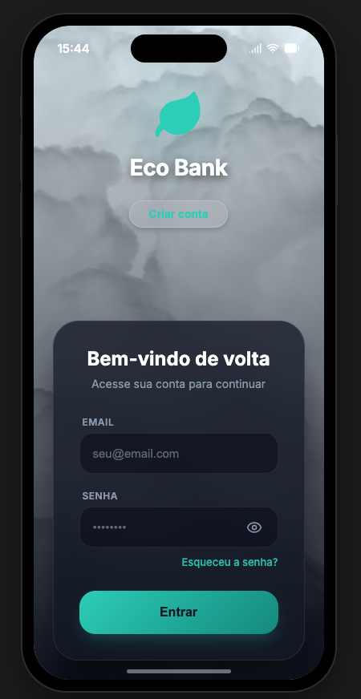
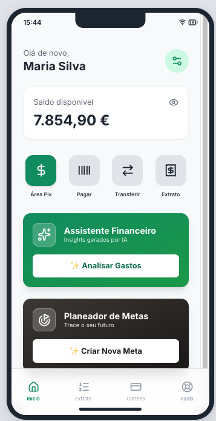
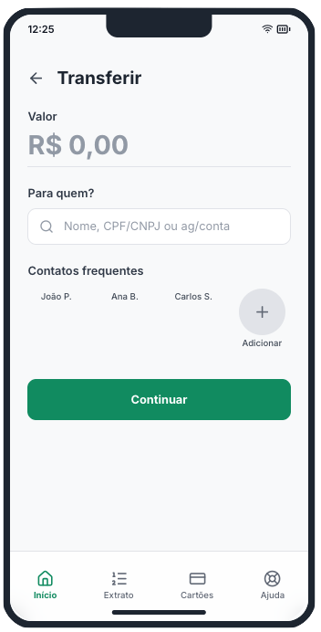
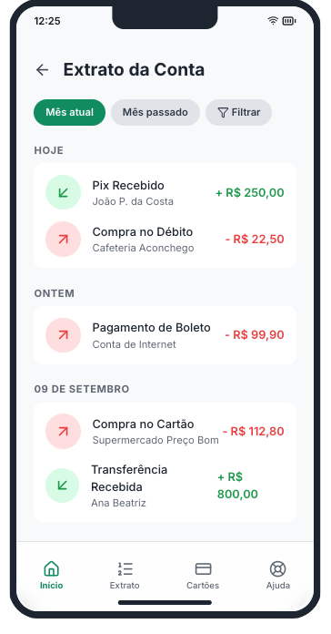
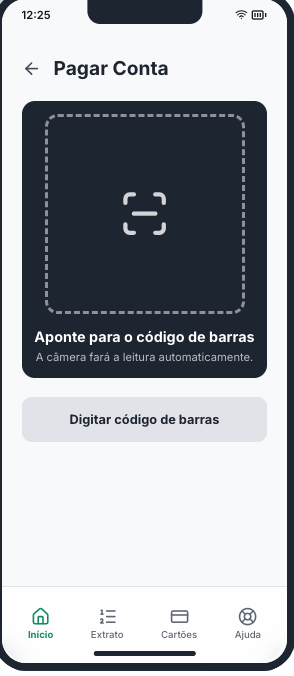
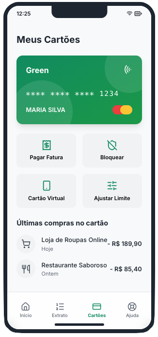

# 🍃 Green Bank | Sustainable Finance

**Green Bank** é um ecossistema bancário digital projetado para unir a gestão financeira moderna à consciência ambiental. Com uma estética **Eco-Dark**, o app utiliza uma paleta de verdes vibrantes, contrastes equilibrados e componentes de **Glassmorphism** sobre um fundo escuro profundo para criar uma experiência de usuário relaxante e eficiente. O objetivo principal é oferecer controle total sobre a vida financeira, unindo transações instantâneas a insights profundos de gastos gerados por IA.

---

## 📱 Visual do Projeto

### 🚀 Onboarding & Dashboard
A jornada começa com uma interface de acesso atmosférica, seguida por um painel central que prioriza a visibilidade do saldo, privacidade e o acesso rápido a serviços essenciais através de um design modular.

| Login & Acesso | Dashboard Principal |
|:---:|:---:|
|  |  |
| **Identidade Visual** | **Gestão de Saldo** |

### 💸 Fluxo de Transações e Pagamentos
O núcleo operacional do app permite movimentações financeiras rápidas e intuitivas. Inclui um extrato detalhado com categorização visual, transferências simplificadas para contatos frequentes e um leitor de boletos inteligente.

| Transferir | Extrato de Conta | Pagar Boleto |
|:---:|:---:|:---:|
|  |  |  |
| **Pix & Contatos** | **Histórico de Fluxo** | **Leitor de Código** |

### 💳 Cartões & Suporte
Gestão completa de ativos físicos e virtuais com foco em segurança. O usuário pode ajustar limites em tempo real, bloquear cartões instantaneamente e acessar uma central de ajuda robusta.

| Meus Cartões | Central de Ajuda |
|:---:|:---:|
|  |  |
| **Gestão de Limite** | **Suporte & FAQ** |

---

## 🛠️ Especificações Técnicas

### Arquitetura
O projeto foi estruturado seguindo os padrões mais modernos de desenvolvimento iOS para garantir escalabilidade e alta performance:
* **MVVM (Model-View-ViewModel):** Separação clara entre lógica de negócio, processamento de dados e interface.
* **Feature-First:** Organização modular dividida por funcionalidades (Auth, Home, Wallet, Support).
* **Component-Based UI:** Biblioteca de componentes customizados para garantir consistência visual e reutilização de código.

### Tech Stack
* **Linguagem:** Swift 5.10+ (Foco em segurança de tipos e performance).
* **Interface:** SwiftUI (Interface declarativa com animações fluidas e suporte a Dynamic Type).
* **IA Integration:** Algoritmos de análise para o **Assistente Financeiro** (Insights de gastos).
* **Persistência:** SwiftData para armazenamento local de contatos frequentes e cache de transações.
* **Segurança:** Lógica de Privacy Mode (mascaramento de dados sensíveis) e prontidão para Biometria.

---
Desenvolvido com 💚 para fins de portfólio em Engenharia de Software iOS.
